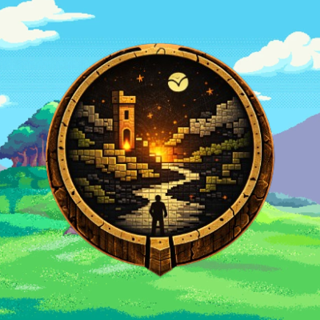

<div align="center">



# Worldcraft

### Your World. Alive. **And It Pays You.**

**Describe a world in one sentence. AI forges it in ~30 seconds. Then walk in, play it, and earn real SOL for completing quests.**

<p>
  <a href="https://playworldcraft.com/"></a>
  <a href="https://playworldcraft.com/play/everhold"></a>
  <a href="https://playworldcraft.com/docs"></a>
  <a href="https://x.com/Playworldcraft"></a>
</p>

<p>
  
  
  
  
  
</p>
<p>
  
  
  
  
</p>

</div>

---

## ✦ Overview

**Worldcraft** is a collaborative worldbuilding RPG with a real economy. You create an entire
fictional universe — think your own Middle-earth, Westeros, or Star Wars galaxy — either by
hand or by describing a single sentence and letting AI generate the whole thing in seconds.
Then you don't just *read* your world… you **walk into it** as a playable, browser-based RPG:
explore zones, talk to NPCs, fight, take on quests, and build a living settlement.

The twist: **quests pay.** Players who hold the Worldcraft token earn **real SOL** on Solana
for completing quests; everyone else earns in-game coins. It's a game you play, a world you
author, and an economy you participate in — in one place, in the browser, nothing to install.

> **Your World. Alive. And It Pays You.**

---

## ✦ Highlights

- 🌍 **AI world generation** — one sentence → a full world (characters, factions, history, map) in ~30s.
- ✍️ **Or build by hand** — six entity types, relationship graphs, timelines, and eras. Everything is editable.
- 🎮 **Actually playable** — a real-time HTML5 Canvas RPG across 3 hand-crafted zones.
- ⚔️ **Combat, NPCs & quests** — 25+ NPCs with dialogue, enemy AI, 8 quests, 28 playable characters.
- 🏗️ **Building** — place structures and props; grow a settlement that persists.
- 💰 **Play-to-earn** — hold the token, complete quests, **claim real SOL** to your wallet.
- 🔐 **Wallet-native** — connect Phantom or sign in with email (Privy spins up a Solana wallet for you).

---

## ✦ 1. Create a world

Every Worldcraft project starts as a **world** — a self-contained universe with its own people,
places, factions, artifacts, species, history, and the relationships that tie them together.

| Path | How it works |
| --- | --- |
| **AI Generation** | Describe a concept — *"a world where music is magic"* — and AI generates a name, description, 8–12 entities, a multi-era timeline, and all the relationships between them in about 30 seconds. |
| **Build manually** | Start empty and craft everything yourself: write lore, define relationships, add events, organize eras. Full control from the first keystroke. |

AI is a **starting point, not a cage** — everything it generates can be renamed, rewritten,
deleted, or expanded. Mix both: generate a base, then shape it by hand.

### Anatomy of a world

Worlds are made of **entities**, the building blocks, in six color-coded types:

| Type | What it is |
| --- | --- |
| 🧑 **Characters** | The people — heroes, villains, rulers, merchants. Full profile pages with lore, facts, and tags. |
| 🗺️ **Locations** | Cities, ruins, temples — anywhere that matters. Plotted on the map and in Explore mode. |
| ⚔️ **Factions** | Organized groups with goals — kingdoms, guilds, cults. Can hold territory. |
| 💎 **Artifacts** | Objects that matter — a legendary sword, a cursed ring. |
| 🐉 **Species** | Races and creatures that populate your world. |
| ⏳ **Events** | Major occurrences — wars, plagues, discoveries — that also live on the timeline. |

On top of entities: an interactive **relationship graph (Connections)**, a **timeline organized
by eras**, and **AI Storytelling**, where characters can evolve over time with new developments
you review and approve.

---

## ✦ 2. Then walk into it

Your world isn't a wiki — it's a place. Worldcraft renders it as a real-time canvas RPG across
three connected zones:

- **The Hub town** — your safe starting point: townsfolk, a merchant, healing spots, and gateways onward.
- **The Grassland** (via the Northern Pass) — orc country. A combat zone with a stronghold, a vendor camp, caves, a mission chain, and a buff shrine.
- **The Seaside Village** (via the Docks) — a coastal settlement of shopkeepers, an elder, a fortune-teller, and the signature *Marina's Lost Necklace* quest. Bandits and wildlife roam.

**Gameplay includes:** real-time movement, combat (`SPACE` to attack) against enemies with real
AI, **25+ NPCs** with branching dialogue, **8 quests and missions**, **28 playable characters**
with color customization, and an **owner-only building system** (`B` to place structures, `R` to
rotate) powered by gathered materials — Wood, Stone, and Gold. Everything you place persists.

---

## ✦ 3. Play-to-earn — the part that pays

Completing quests grants rewards. **Token holders earn real SOL** (Solana mainnet); non-holders
earn in-game coins. Your reward is the quest's base SOL amount multiplied by your **holder tier**,
which scales with how much of the token supply your wallet holds.

### Holder tiers

> Total supply: **1,000,000,000 (1B)**. Your tier is read live from your connected wallet.

| Tier | Holdings (% of supply) | Tokens | Multiplier |
| --- | --- | --- | --- |
| Non-holder | below 0.001% | < 10K | in-game coins only |
| **Holder** | 0.001% – 0.25% | 10K – 2.5M | **1×** |
| **Bronze** | 0.25% – 0.5% | 2.5M – 5M | **1.25×** |
| **Silver** | 0.5% – 1% | 5M – 10M | **1.5×** |
| **Gold** | 1% – 2% | 10M – 20M | **2×** |
| **Diamond** | 2%+ | 20M+ | **3×** |

The multiplier **caps once a wallet holds more than 3.5% of supply (35M tokens)** — an anti-whale
rule that keeps rewards spread across the community.

### Claiming

Earnings accrue **automatically, server-side**, and you withdraw them with the **Claim** button on
the [Earnings dashboard](https://playworldcraft.com/dashboard/earnings):

- Up to **4 claims per day**, at least **6 hours apart**.
- A **global daily reward pool** caps total payouts across all players each day.
- A **per-claim ceiling** so no single claim can drain the pool.
- You must **still hold the token at claim time** to receive SOL.

### Fair play

Each quest pays **once per account, ever**. Anti-farming protections apply: minimum account age
and playtime before a first claim, bot/velocity checks, a live holdings re-check at claim time,
and atomic, race-safe accounting so a claim can never be paid twice. Rewards are a reward for
playing — **not an investment or a promise of profit.**

> **Token status:** the contract address is **TBA** — until the token launches, everyone earns
> in-game coins; real SOL payouts switch on the moment the mint is configured.

---

## ✦ Tech stack

| Layer | Technology |
| --- | --- |
| **Framework** | Next.js 16 (App Router), React 19, TypeScript |
| **Game engine** | Custom HTML5 Canvas 2D renderer (tilesets, sprites, real-time loop) |
| **Database** | PostgreSQL via Prisma ORM |
| **Auth** | [Privy](https://privy.io) — wallet (Phantom, etc.) + email, with Solana embedded wallets; bridged to a JWT session |
| **Chain** | Solana mainnet via `@solana/web3.js`, RPC by Helius |
| **AI** | World generation + storytelling via OpenRouter |
| **Hosting** | Docker on Railway |

---

## ✦ Architecture

```
Browser (Canvas RPG + React UI)
   │  complete quest ─────────────►  POST /api/quests/complete
   │                                   └─ reads live token balance (Helius) → resolves tier
   │                                   └─ writes a once-per-quest earning to Postgres
   │
   │  click "Claim" ──────────────►  POST /api/payouts/claim
   │                                   └─ atomic, race-safe reservation (no double-pay)
   │                                   └─ sends real SOL from the treasury (priority fee + confirm)
   │                                   └─ verifies the tx landed before finalizing
   │
   └─ Connect Wallet (Privy) ─────►  POST /api/auth/privy  → verifies token, links wallet, issues session
```

The **earnings ledger** (every quest completion and claim) lives server-side in PostgreSQL — the
source of truth for how much SOL anyone can claim. In-game progress like coins and materials is
saved client-side. Economics (per-quest rewards, tiers, limits, pool) are all tunable in one file:
[`src/lib/payouts/config.ts`](src/lib/payouts/config.ts). Full design notes: [`docs/play-to-earn.md`](docs/play-to-earn.md).

---

## ✦ Project structure

```
src/
├── app/
│   ├── page.tsx                      # Landing
│   ├── docs/ about/ how-it-works/    # Public content
│   ├── discover/                     # Public world directory
│   ├── dashboard/
│   │   └── earnings/                 # Claim SOL + tier/holdings + live cooldown
│   ├── play/[slug]/                  # Fullscreen game entry
│   ├── worlds/[slug]/
│   │   ├── explore/                  # The Canvas RPG (WorldExplore + CharacterPicker)
│   │   ├── entities/ graph/ timeline/ map/   # Worldbuilding views
│   └── api/
│       ├── auth/privy/               # Privy → session bridge
│       ├── quests/complete/          # Record quest earnings
│       └── payouts/{summary,claim}/  # Earnings + withdrawals
├── lib/
│   ├── payouts/
│   │   ├── config.ts                 # ⭐ All economics (tiers, limits, pool)
│   │   ├── engine.ts                 # Earn + claim engine (race-safe)
│   │   └── solana.ts                 # Token-balance reads + SOL transfers
│   ├── privy-server.ts               # Server-side Privy verification
│   ├── prisma.ts / queries.ts        # Database
│   └── tileAtlas.ts                  # Sprite/tileset coordinates
└── prisma/schema.prisma              # Data model
```

---

## ✦ Quick start (local)

```bash
npm install
cp .env.example .env        # fill in the values
npm run db:push             # sync the schema to your database
npm run dev                 # http://localhost:3000
```

- Play the demo world instantly (no account): **`/play/everhold`**.
- Leave `PAYOUTS_ENABLED=false` for local dev — the payout engine runs in **stub mode** (no SOL
  moves). Set `STUB_TOKEN_BALANCE` to simulate a holder and exercise the tier/claim flow.

---

## ✦ Environment

All keys are documented in [`.env.example`](.env.example). The essentials:

| Variable | Purpose |
| --- | --- |
| `DATABASE_URL` | PostgreSQL connection string |
| `JWT_SECRET` | Session signing secret |
| `NEXT_PUBLIC_PRIVY_APP_ID` / `PRIVY_APP_SECRET` | Privy auth |
| `HELIUS_RPC_URL` | Solana mainnet RPC (balances + payouts) |
| `PAYOUT_TOKEN_MINT` / `PAYOUT_TOKEN_SUPPLY` | Gating token + supply for tier math |
| `TREASURY_SECRET_KEY` | Wallet that funds payouts |
| `PAYOUTS_ENABLED` | `true` to send real SOL |
| `PAYOUT_DAILY_CAP_SOL` | Global daily payout ceiling |
| `OPENROUTER_API_KEY` | AI world generation |

---

## ✦ Deploy (Railway)

1. Push to GitHub, then in Railway: **New Project → Deploy from GitHub repo**.
2. Add the environment variables from `.env.example` in the **Variables** tab.
3. Railway builds from the [`Dockerfile`](Dockerfile) (Node 20). The schema syncs on container
   start (`prisma db push`), so the build never needs a live database.
4. Railway provides `PORT`; the container binds to it automatically.
5. Add your domain under **Settings → Networking**, and add it to **Privy → allowed origins**.

Build/run config is pinned in [`railway.json`](railway.json).

---

## ✦ Scripts

| Command | Description |
| --- | --- |
| `npm run dev` | Start the dev server |
| `npm run build` | Production build (`prisma generate` + `next build`) |
| `npm run start` | `prisma db push` + start the server |
| `npm run db:push` | Push schema to the database |
| `npm run db:seed` | Seed the demo world (Everhold) |

---

## ✦ Links

- 🌐 **Website** — <https://playworldcraft.com/>
- ▶️ **Play the demo** — <https://playworldcraft.com/play/everhold>
- 📖 **Docs** — <https://playworldcraft.com/docs>
- 🐦 **X / Twitter** — <https://x.com/Playworldcraft>

---

## ✦ License

© 2026 Worldcraft. All rights reserved.

<div align="center">

---

**Built with [Mythos](https://www.anthropic.com/) · Powered by Solana**

<sub>Rewards depend on the treasury and daily pool. Nothing here is financial advice.</sub>

</div>
